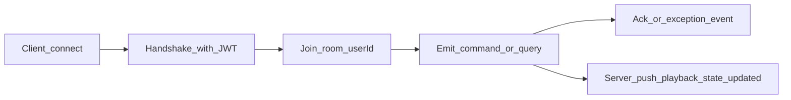

# Playback WebSocket API

Playback state is synchronized over **Socket.IO** using the Nest gateway in [`playback.gateway.ts`](./playback.gateway.ts).

**Payload shapes (Zod / TypeScript):** [`@repo/contracts`](../../../../../packages/contracts/src/playback/) — see request files under `playback/request/` and [`playback.schema.ts`](../../../../../packages/contracts/src/schemas/playback.schema.ts) for `PlaybackState`, `PlaybackTrack`, and related types.

---

## Connection

| Item            | Value                                                                                                                   |
| --------------- | ----------------------------------------------------------------------------------------------------------------------- |
| **Namespace**   | `playback`                                                                                                              |
| **Example URL** | `http://<API_HOST>:<PORT>/playback` (same host/port as the HTTP API; use `https`/`wss` when the API is served over TLS) |
| **CORS**        | Follows API CORS settings; `credentials: true` when applicable                                                          |

---

## Authentication (handshake)

Only these sources are supported (enforced by [`extractAccessTokenFromSocket`](../../common/utils/ws.util.ts) and [`WsJwtGuard`](../auth/guards/ws-jwt.guard.ts)):

1. **`socket.handshake.auth.token`** (string), or
2. **HTTP header** `Authorization: Bearer <access_jwt>`

Query parameters (for example `?token=...`) are intentionally **not** read: putting a JWT in the URL risks leaking it via server logs, proxies, referrer headers, and browser history.

If the token is missing or invalid, the connection is rejected. After a successful connection, the socket joins the room `user:<userId>` (see `handleConnection` in the gateway).

---

## Client → server events

Emit these event names with a JSON body where noted. With Socket.IO acknowledgments enabled, the **ack** payload is the value returned by the server handler.

| Event name                       | Message body                                                                                                             | Ack (success)                                                                                     | Notes                                                                                                                                                                          |
| -------------------------------- | ------------------------------------------------------------------------------------------------------------------------ | ------------------------------------------------------------------------------------------------- | ------------------------------------------------------------------------------------------------------------------------------------------------------------------------------ |
| `query:get-state`                | Omit or `{}`                                                                                                             | [`PlaybackState`](../../../../../packages/contracts/src/schemas/playback.schema.ts) **or `null`** | **`null`** means no stored state yet (no Redis document). The exported `GetPlaybackStateResponse` type in contracts may not include `null`; treat the runtime ack as nullable. |
| `command:set-state`              | [`SetPlaybackStateRequest`](../../../../../packages/contracts/src/playback/request/set-playback-state.request.ts)        | `PlaybackState`                                                                                   | Full snapshot. **`expectedVersion === 0`**: create if missing. **`expectedVersion > 0`**: update only if it matches stored `version`.                                          |
| `command:set-current-time-state` | [`SetCurrentTimeStateRequest`](../../../../../packages/contracts/src/playback/request/set-current-time-state.request.ts) | `PlaybackState`                                                                                   | Partial update. **`expectedVersion`** must match current server `version` (**not** `0`).                                                                                       |
| `command:set-favorite-state`     | [`SetFavoriteStateRequest`](../../../../../packages/contracts/src/playback/request/set-favorite-state.request.ts)        | `PlaybackState`                                                                                   | Same versioning rules as other partial commands.                                                                                                                               |
| `command:set-library-state`      | [`SetLibraryStateRequest`](../../../../../packages/contracts/src/playback/request/set-library-state.request.ts)          | `PlaybackState`                                                                                   | Same versioning rules.                                                                                                                                                         |
| `command:set-playing-state`      | [`SetPlayingStateRequest`](../../../../../packages/contracts/src/playback/request/set-playing-state.request.ts)          | `PlaybackState`                                                                                   | Same versioning rules.                                                                                                                                                         |
| `command:set-repeat-state`       | [`SetRepeatStateRequest`](../../../../../packages/contracts/src/playback/request/set-repeat-state.request.ts)            | `PlaybackState`                                                                                   | Same versioning rules.                                                                                                                                                         |
| `command:set-track-state`        | [`SetTrackStateRequest`](../../../../../packages/contracts/src/playback/request/set-track-state.request.ts)              | `PlaybackState`                                                                                   | Body field is **`track`**; persisted on `PlaybackState` as **`trackData`**. Same versioning rules.                                                                             |
| `command:set-shuffle-state`      | [`SetShuffleStateRequest`](../../../../../packages/contracts/src/playback/request/set-shuffle-state.request.ts)          | `PlaybackState`                                                                                   | Same versioning rules.                                                                                                                                                         |
| `command:set-volume-level-state` | [`SetVolumeLevelStateRequest`](../../../../../packages/contracts/src/playback/request/set-volume-level-state.request.ts) | `PlaybackState`                                                                                   | Same versioning rules.                                                                                                                                                         |

---

## Versioning

- **`PlaybackState.version`** is owned by the server and incremented on every successful write.
- **`command:set-state`**: use **`expectedVersion: 0`** to create the first document when none exists; use the current **`version`** from the server for updates. Logic lives in [`playback-state-persistence.service.ts`](./services/playback-state-persistence.service.ts) (`createIfAbsent` / `applyMutation`).
- **Partial commands** (`command:set-*` except full `set-state`): send **`expectedVersion`** equal to the last known server **`version`**. Sending **`0`** is rejected with a bad request (handlers require an existing document and a non-zero expected version for updates).
- On mismatch or conflicts, the server responds with an error (see [Errors](#errors)).
- After a successful mutation, the server broadcasts **`event:playback-state-updated`** with the full new state, including the new **`version`**. Clients should update their local copy from the ack and/or this event.

---

## Server → client push

| Event                          | Payload         | When                                                                                                                                             |
| ------------------------------ | --------------- | ------------------------------------------------------------------------------------------------------------------------------------------------ |
| `event:playback-state-updated` | `PlaybackState` | After each successful `command:set-state` and each successful partial `command:set-*` in the gateway; emitted to all sockets in `user:<userId>`. |

Clients should **subscribe** to `event:playback-state-updated` and treat the payload as authoritative (especially **`version`** and playback fields).

---

## Errors

- The gateway uses [`PlaybackWsExceptionFilter`](../../common/filters/ws-exception.filter.ts), which maps **`HttpException`** to **`WsException`**.
- Clients should listen for the Socket.IO **`exception`** event (Nest `BaseWsExceptionFilter` behavior) for structured error payloads.
- Typical cases:
  - **400** — validation / bad request (e.g. invalid body, `expectedVersion === 0` on a partial update).
  - **404** — no stored playback state when an update expects a document.
  - **409** — version mismatch or “state already exists” on create.
  - **503** — optimistic-lock retries exhausted under contention (`ServiceUnavailableException`).

---

## Flow overview

Successful mutations produce both an **ack** (to the caller) and, when applicable, **`event:playback-state-updated`** to all connections for that user.
